# C3PO NODE

A persistent Windows C2 agent and Flask-based control server built for authorized red/blue team lab exercises. The goal is to simulate a realistic implant infection so blue team can practice detection, process hunting, and removal — on hardware you own and control.

> **Lab use only.** This project was built and tested against a single authorized machine on an isolated LAN. Do not deploy outside your own lab.

---

## Architecture

```
[Windows Target]                    [Linux C2 Server]
  agent (Go binary)   ←──beacon──►   c3po_server.py (Flask)
  - AES-256-CBC C2                    - SQLite database
  - XOR-obfuscated strings            - Web dashboard
  - ETW/AMSI patched                  - Task queue
  - Keylogger                         - File uploads / agent updates
  - Credential harvest
  - Network monitor
  - XMRig miner
  - BYOVD (gdrv.sys)
```

**Agent** — written in Go, cross-compiled for Windows. Beacons every ~30s, executes tasks from the queue, reports results back. All C2 traffic is AES-256-CBC encrypted and base64-encoded. Sensitive strings (C2 URL, AES key/IV) are XOR-obfuscated in the binary.

**Server** — Python/Flask. Stores everything in SQLite. Ships a terminal-style web dashboard for issuing tasks, reviewing intelligence, and pushing agent updates.

---

## Dashboard

### Overview & Agent Update Manager
Tracks online nodes, commands executed, keylog batches, discovered hosts, and credential findings. Push new agent builds to all nodes in one click.

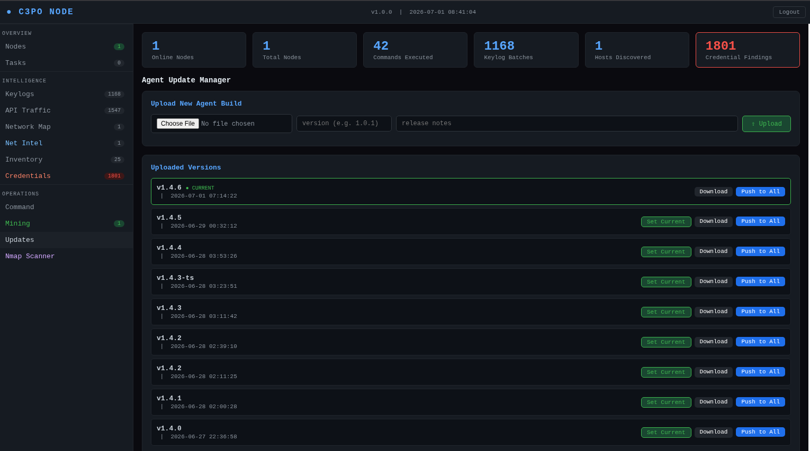

### Task Queue
Full task history with type, payload, status, and expandable output per task. Supports `exec`, `ps`, `mine_start/stop`, `inject`, `revshell`, `byovd_arm`, `harvest`, `spread`, `update`, and more.

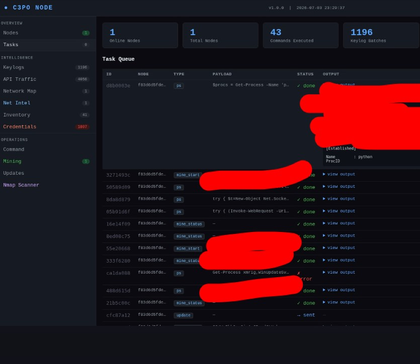

### Keylog Stream
Live keylog stream across all nodes, timestamped per window title. Captures active window context alongside keystrokes.

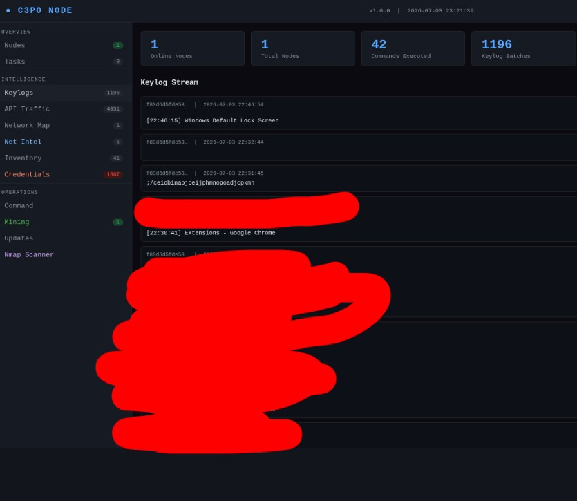

### API Traffic Monitor
Per-process network connection table updated every 90s. Shows process name, command line, local/remote address, protocol, and TCP state. Highlight or kill a process directly from the dashboard.

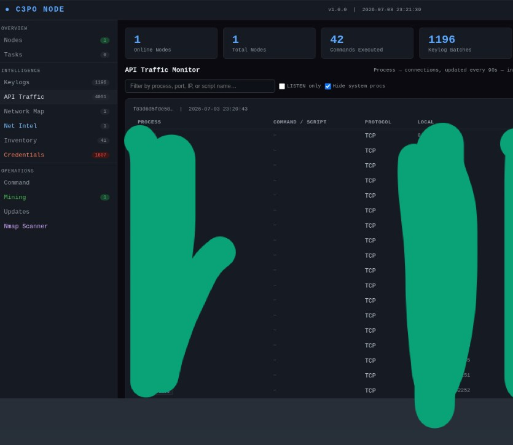

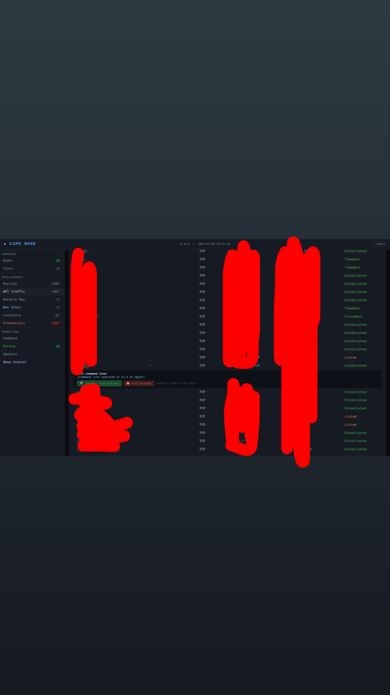

### System Inventory
Full hardware/software snapshot collected on agent startup and every 4 hours. Inspect raw JSON per collection.

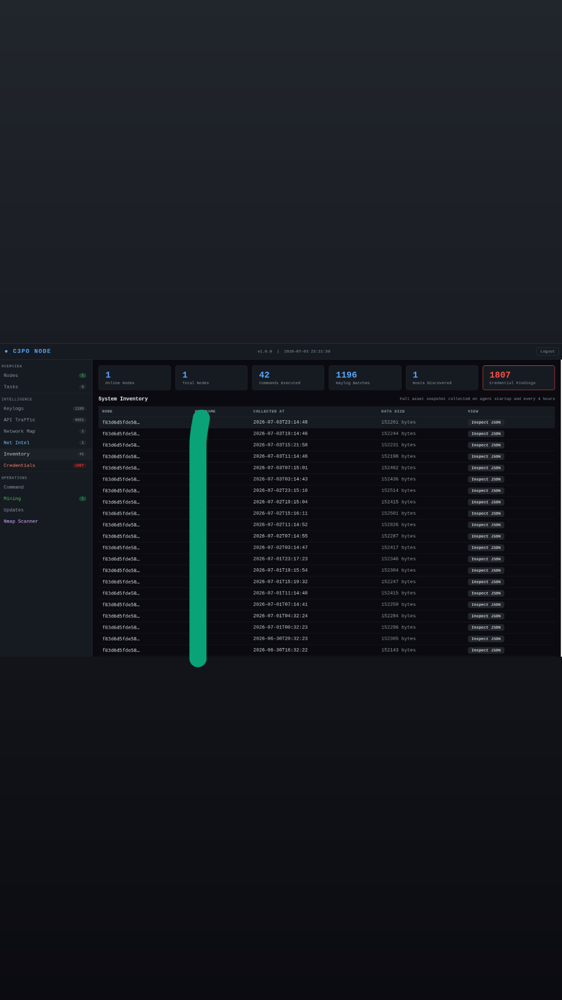

### Credential Findings

**Generic secrets & API keys** — scans env files, config files, and memory for JWT tokens, OpenAI keys, and generic secrets.

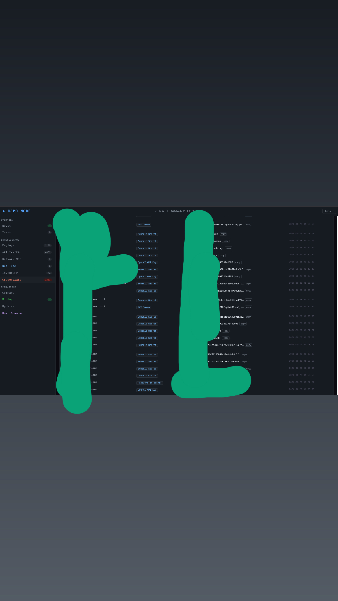

**Browser saved passwords** — harvests Chrome/Edge DPAPI-encrypted saved credentials.

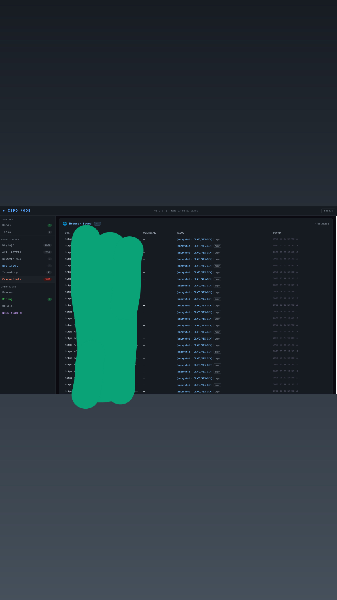

**Key files** — finds `.pem`, `.key`, and JSON wallet files containing RSA/DSA private keys and seed fields.

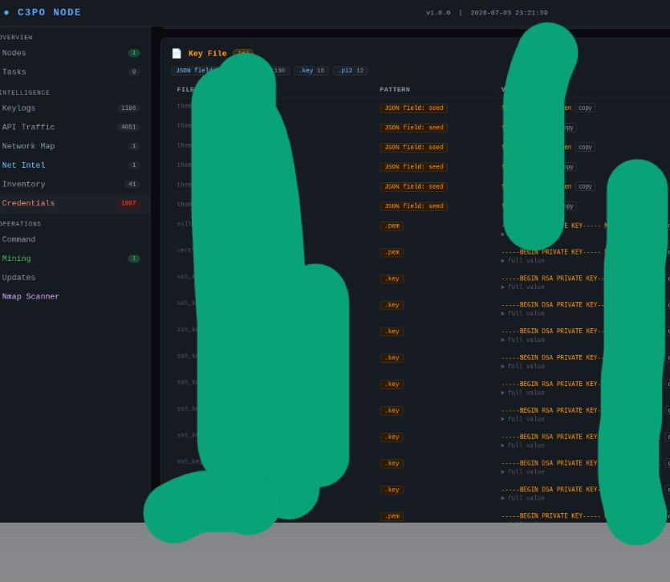

**Seed phrases** — detects BIP39 mnemonic patterns across the filesystem.

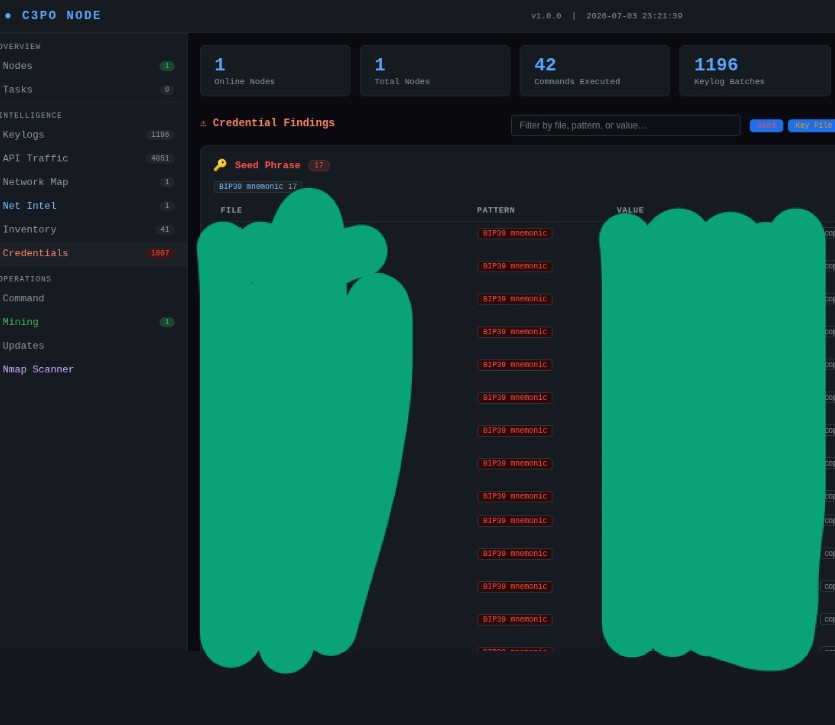

### Network Map & Host Discovery
Discovered hosts from agent subnet sweeps and nmap scans, merged into a single view with open ports and SMB flags.

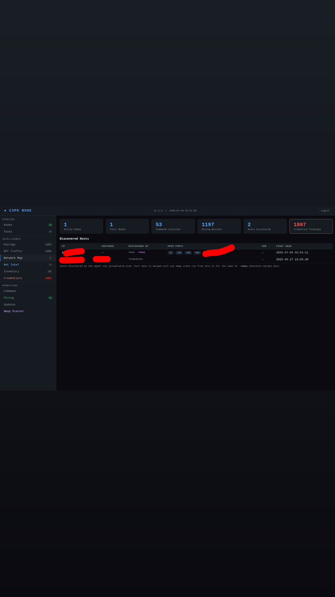

### Nmap Scanner
Run nmap directly from the C2 server against discovered hosts. Results feed back into the Network Map automatically.

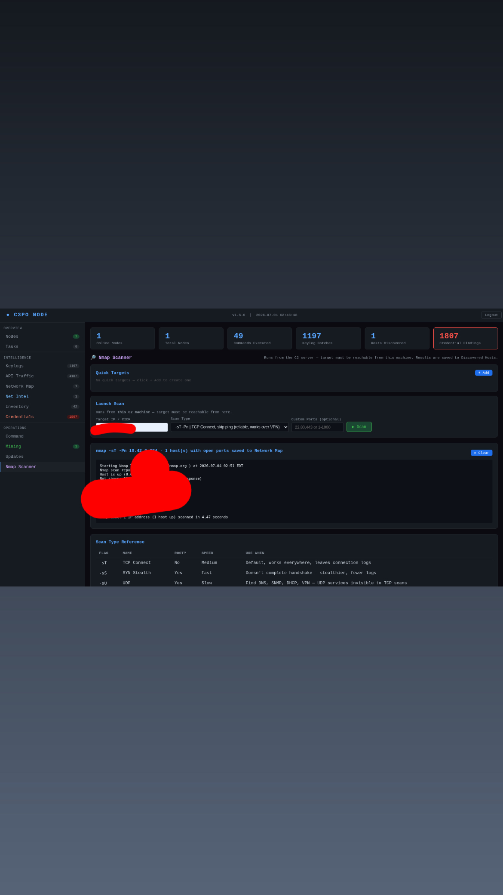

### Mining Control
Deploy XMRig to nodes via the C2. Control CPU cap, GPU toggle, coin, pool, and wallet from the dashboard. Live hashrate reported back.

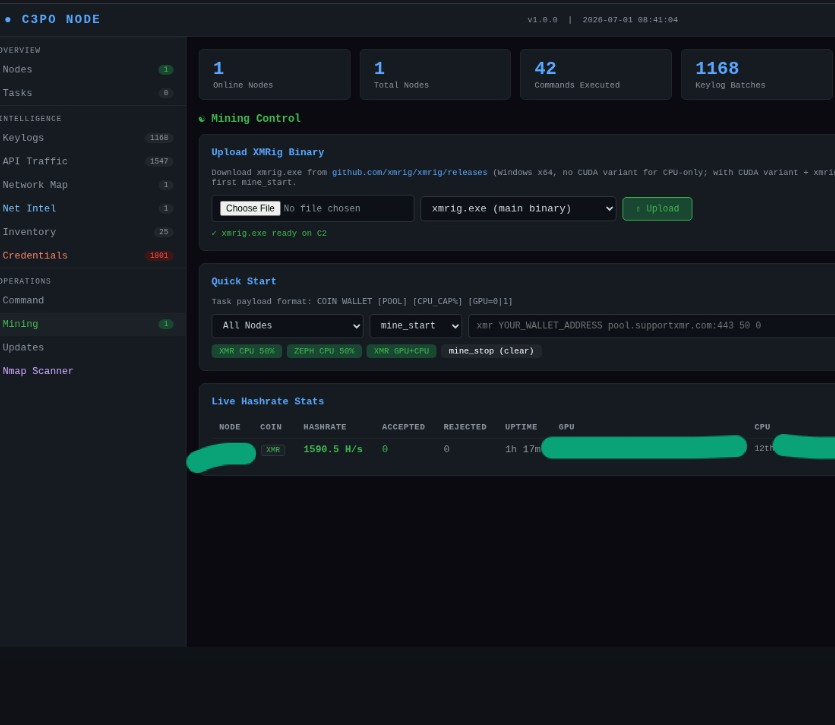

---

## Agent Capabilities

| Category | Capability |
|---|---|
| Persistence | Scheduled task (SYSTEM, HIGHEST) |
| Evasion | ETW patch, AMSI patch, sandbox detection (4h sleep), XOR string obfuscation |
| Collection | Keylogger, credential harvest, system inventory, network monitor, API traffic capture |
| Recon | Subnet sweep, port scan, hostname resolution, net intel |
| Execution | Shell exec, PowerShell, process injection (remote/hollowing), shellcode |
| Lateral | Reverse shell, network spread |
| Mining | XMRig deployment, CPU/GPU control, live hashrate reporting |
| Kernel | BYOVD via gdrv.sys (CVE-2018-19320) — DSE disable via ring0 memcpy |
| Anti-forensics | Event log clear, self-destruct, PPL process protection |
| Updates | Self-update — pulls new agent build from C2, restarts cleanly |

---

## Setup

### Server (Linux)

```bash
cd server/
cp config.json.example config.json   # edit with your own credentials + AES key/IV
pip install flask flask-limiter werkzeug pycryptodome
bash start.sh
```

On first run with no `config.json`, the server auto-generates random credentials and prints them to stdout.

### Agent (build from source)

```bash
cd agent/
# 1. Edit crypto.go — update c2URLObf, aesKeyObf, aesIVObf to match your server config
#    Run scripts/encrypt_c2.py to generate the XOR-encoded byte arrays
# 2. Build
GOOS=windows GOARCH=amd64 go build \
  -tags miner \
  -ldflags "-s -w -H windowsgui -X main.Version=1.5.0" \
  -o ../c3po-node-v1.5.0.exe .
```

### Retargeting (new C2 IP / new keys)

```bash
python3 scripts/encrypt_c2.py
# Enter your C2 URL, AES key, and IV when prompted
# Paste the output byte arrays into agent/crypto.go
# Update c2_aes_key and c2_aes_iv in server/config.json to match
# Rebuild the agent
```

### gdrv.sys (BYOVD)

The `byovd_arm` task requires the GIGABYTE gdrv.sys driver (CVE-2018-19320). Source it separately from [LOLDrivers](https://www.loldrivers.io/drivers/e4b5b743-c6b0-4c5b-a56b-e3d2f08d64b7/) and place it at `server/uploads/gdrv.sys`. The agent downloads and loads it on demand.

---

## Blue Team Exercise

The intended workflow is:
1. Deploy agent to your authorized Windows target
2. Let it run — collect keylogs, credentials, inventory, establish persistence
3. Switch to blue team mode: find the process, identify persistence, pull the IOCs, remove it
4. Key artifacts to hunt: scheduled task named after a common system binary, beacon traffic every ~30s to your C2 IP, XMRig child process if mining was started

---

## Project Structure

```
agent/          Go source — Windows agent
stager/         Lightweight dropper stub
server/         Python/Flask C2 server + SQLite + web dashboard
scripts/        encrypt_c2.py — generate XOR-encoded byte arrays for crypto.go
```

---

## Dependencies

**Agent**: `golang.org/x/sys/windows`

**Server**: `flask`, `flask-limiter`, `werkzeug`, `pycryptodome`
